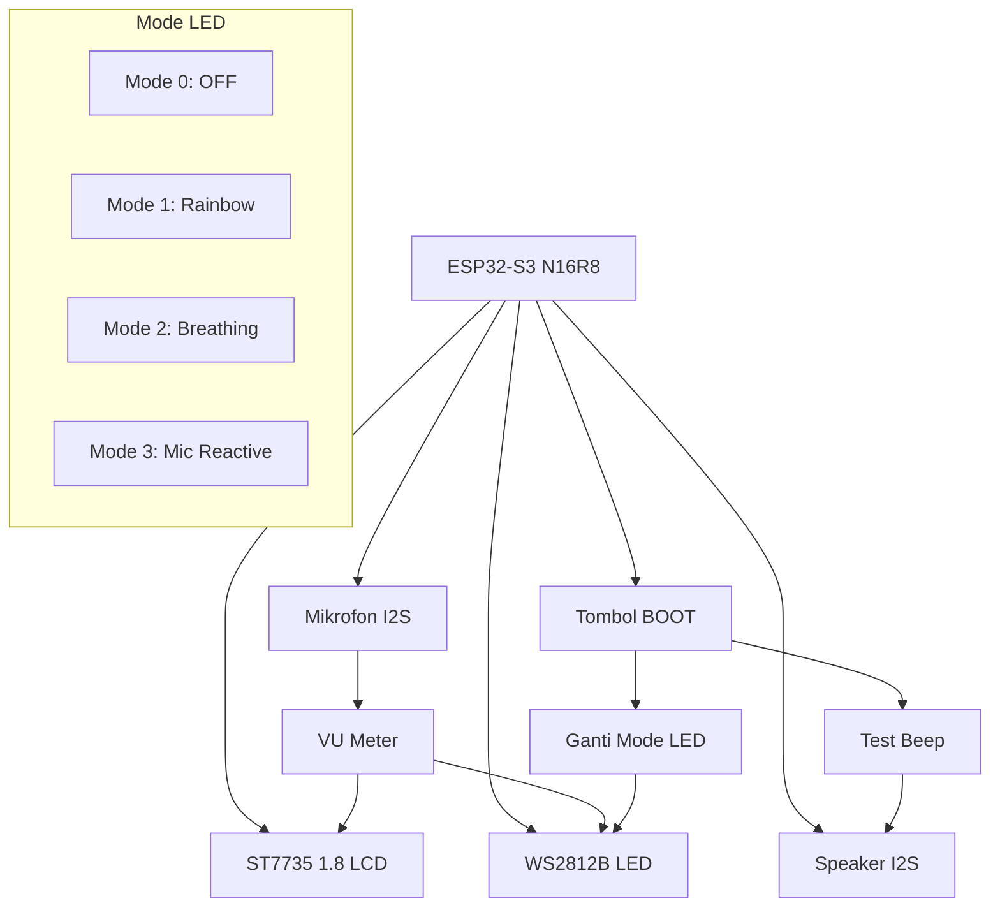

# ESP32-S3 Voice Beep dengan WS2812 dan Display 1.8"

Proyek Arduino untuk ESP32-S3 yang mengintegrasikan berbagai komponen hardware termasuk display ST7735 1.8", mikrofon, speaker, dan LED WS2812B (NeoPixel).

## 📋 Gambaran Umum

Proyek ini merupakan sistem monitoring dan testing hardware lengkap untuk ESP32-S3 yang menampilkan:
- **Display ST7735 1.8"** (128x160) untuk status sistem
- **Mikrofon I2S** untuk deteksi suara dengan visualisasi VU meter
- **Speaker I2S** untuk menghasilkan tone beep
- **LED WS2812B** (NeoPixel) dengan berbagai mode efek
- **Tombol BOOT** untuk kontrol interaktif

## 🛠️ Spesifikasi Hardware

### Board ESP32-S3
- **Model**: ESP32-S3 N16R8
- **Flash**: 16MB
- **PSRAM**: 8MB

### Komponen yang Digunakan

| Komponen | Pin GPIO | Fungsi |
|----------|----------|---------|
| **ST7735 1.8" LCD** |  |  |
| - SCLK | 21 | Clock SPI |
| - MOSI | 47 | Data SPI |
| - CS | 41 | Chip Select |
| - DC | 40 | Data/Command |
| - RST | 45 | Reset |
| - BL | 42 | Backlight |
| **Speaker I2S** |  |  |
| - DOUT | 7 | Data Out |
| - BCLK | 15 | Bit Clock |
| - LRC | 16 | Left/Right Clock |
| **Mikrofon I2S** |  |  |
| - WS | 4 | Word Select |
| - SCK | 5 | Serial Clock |
| - SD | 6 | Serial Data |
| **WS2812B LED** | 48 | NeoPixel Control |
| **Tombol BOOT** | 0 | Input Control |

## 🎯 Fitur Utama

### 1. **Display Monitoring**
- Status real-time semua komponen
- Visualisasi level mikrofon dengan bar meter
- Informasi mode LED aktif
- Interface user-friendly dengan border dan warna

### 2. **Deteksi Suara (VU Meter)**
- Pembacaan level suara real-time melalui mikrofon I2S
- Visualisasi bar meter dengan warna:
  - 🟢 **Hijau**: Level rendah (0-500)
  - 🟡 **Kuning**: Level medium (500-800)
  - 🔴 **Merah**: Level tinggi (800-1000)
- Output serial dengan ASCII bar graph

### 3. **Mode LED WS2812B**
- **Mode 0**: LED Mati
- **Mode 1**: Rainbow Cycle (perubahan warna terus menerus)
- **Mode 2**: Breathing Effect (efek napas biru)
- **Mode 3**: Mic Reactive (LED merespon level suara)

### 4. **Kontrol Tombol BOOT**
- **Tekan pendek** (<1 detik): Test beep speaker
- **Tekan panjang** (>1 detik): Ganti mode LED

### 5. **Output Speaker**
- Generasi tone sinusoidal 440Hz dan 523Hz
- Output stereo melalui I2S
- Visual feedback dengan LED saat beep

## 📊 Diagram Arsitektur Sistem



## 🚀 Instalasi dan Penggunaan

### Prasyarat
- **Arduino IDE** dengan support ESP32-S3
- **Board Manager URL**: `https://raw.githubusercontent.com/espressif/arduino-esp32/gh-pages/package_esp32_index.json`
- **Library yang Diperlukan**:
  - Adafruit GFX Library
  - Adafruit ST7735 and ST7789 Library
  - Adafruit NeoPixel Library

### Langkah Instalasi

1. **Sambungkan Hardware**:
   ```
   ESP32-S3 → ST7735 LCD (SPI)
   ESP32-S3 → Mikrofon I2S (GPIO 4,5,6)
   ESP32-S3 → Speaker I2S (GPIO 7,15,16)
   ESP32-S3 → WS2812B (GPIO 48)
   ```

2. **Upload Kode**:
   - Buka file `05-ESP32-S3_voiceBeep-withWS2812-display1.8.ino` di Arduino IDE
   - Pilih board: `ESP32S3 Dev Module`
   - Pilih port COM yang sesuai
   - Upload kode

3. **Monitor Serial**:
   - Buka Serial Monitor pada 115200 baud
   - Lihat output status dan level mikrofon

### Cara Penggunaan

1. **Setelah boot**, sistem akan:
   - Inisialisasi semua komponen
   - Menampilkan status di LCD
   - Memainkan test beep
   - Menampilkan interface monitoring

2. **Testing Mikrofon**:
   - Berbicara atau bertepuk tangan di depan mikrofon
   - Perhatikan bar meter di LCD dan output serial

3. **Kontrol LED**:
   - **Tekan pendek** BOOT button: Test beep speaker
   - **Tekan panjang** (>1 detik): Ganti mode LED

## 📁 Struktur Kode

### File Utama
- `05-ESP32-S3_voiceBeep-withWS2812-display1.8.ino` - Kode utama Arduino

### Fungsi Penting

| Fungsi | Deskripsi |
|--------|-----------|
| `initLCD()` | Inisialisasi display ST7735 |
| `initSpeaker()` | Konfigurasi I2S untuk speaker |
| `initMicrophone()` | Konfigurasi I2S untuk mikrofon |
| `initLED()` | Inisialisasi WS2812B NeoPixel |
| `playTone()` | Generasi tone sinusoidal |
| `readMicLevel()` | Pembacaan level suara |
| `updateLED()` | Kontrol mode LED |
| `drawMicLevel()` | Visualisasi VU meter di LCD |

## 🔧 Konfigurasi

### Parameter yang Dapat Disesuaikan

```cpp
// Sampling rate audio
#define SAMPLE_RATE 16000

// Kecerahan LED (0-255)
strip.setBrightness(80);

// Threshold level mikrofon
if (level > 500) barColor = ST77XX_YELLOW;
if (level > 800) barColor = ST77XX_RED;

// Durasi tekan tombol
if (press_duration < 1000) // Short press
if (press_duration > 1000) // Long press
```

## 🐛 Troubleshooting

### Masalah Umum dan Solusi

1. **LCD Tidak Menyala**
   - Periksa koneksi SPI
   - Pastikan pin backlight (GPIO 42) HIGH
   - Cek konfigurasi INITR_BLACKTAB

2. **Tidak Ada Suara dari Speaker**
   - Verifikasi koneksi I2S
   - Periksa konfigurasi sample rate (16kHz)
   - Pastikan driver I2S terinstall

3. **Mikrofon Tidak Bekerja**
   - Cek koneksi I2S mikrofon
   - Verifikasi buffer size dan sampling
   - Pastikan tidak ada konflik pin

4. **LED WS2812B Tidak Menyala**
   - Periksa koneksi data (GPIO 48)
   - Pastikan library NeoPixel terinstall
   - Cek koneksi ground dan VCC

## 📈 Output Serial

Sistem menampilkan informasi real-time di Serial Monitor:

```
[████████████████████                    ] Lvl: 520 🔊 | LED:3
[████████████████████████████            ] Lvl: 750 🔊 | LED:3
[████████████                            ] Lvl: 300 🔉 | LED:3
```

**Legenda Emoji**:
- 🔇: Level sangat rendah (<100)
- 🔉: Level rendah (100-300)
- 🔊: Level medium (300-600)
- 📢: Level tinggi (>600)

## 🎨 Customization

### Menambah Mode LED Baru

```cpp
// Tambah di deklarasi variabel
int led_mode = 4; // 0-3 existing, tambah 4

// Tambah case di updateLED()
case 4: // Custom mode
    // Implementasi mode custom
    break;

// Update updateLEDModeDisplay()
case 4: tft.print("Custom"); break;
```

### Mengubah Warna Theme

```cpp
// Warna default
ST77XX_BLUE, ST77XX_CYAN, ST77XX_YELLOW

// Ganti dengan warna custom
tft.setTextColor(0x07E0); // Hijau
tft.setTextColor(0xF800); // Merah
```

## 📄 Lisensi

Proyek ini menggunakan lisensi MIT. Silakan digunakan untuk keperluan edukasi dan pengembangan.

## 🤝 Kontribusi

Kontribusi dipersilakan! Silakan buat pull request atau buka issue untuk diskusi.

---

**Dibuat dengan ❤️ untuk komunitas ESP32 Indonesia**