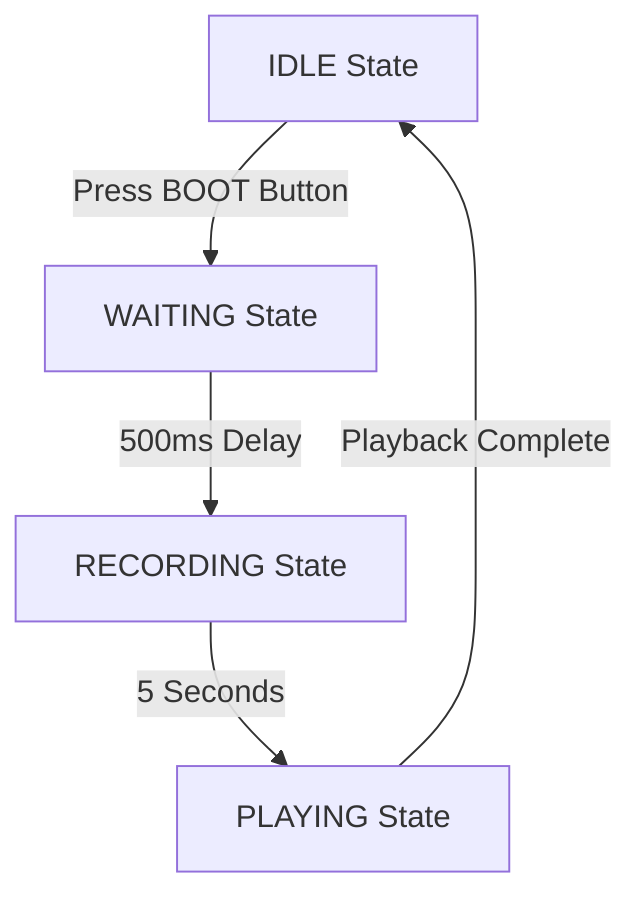

# ESP32-S3 Voice Monitoring dengan Display 1.8 inch

Proyek ini merupakan sistem perekam suara berbasis ESP32-S3 yang dilengkapi dengan display ST7735 1.8 inch dan indikator LED WS2812B. Sistem ini dapat merekam suara selama 5 detik dan memutarnya kembali dengan tampilan visual yang informatif.

## 📋 Gambaran Umum

Voice Recorder ESP32-S3 ini memiliki fitur-fitur berikut:
- **Perekaman Suara 5 Detik** dengan kualitas 16kHz
- **Display ST7735 1.8"** (128x160) dengan antarmuka visual yang informatif
- **Indikator LED WS2812B** dengan warna berbeda untuk setiap status
- **Delay 500ms** untuk menghindari suara klik tombol
- **Progress Bar** visual untuk monitoring proses
- **Antarmuka yang Responsif** dengan update display yang optimal

## 🛠️ Spesifikasi Teknis

### Hardware Requirements
- **MCU**: ESP32-S3
- **Display**: ST7735 1.8 inch (128x160 pixels)
- **LED**: WS2812B (NeoPixel)
- **Microphone**: I2S Microphone
- **Speaker**: I2S Speaker
- **Button**: BOOT Button (GPIO0)

### Audio Specifications
- **Sample Rate**: 16,000 Hz
- **Recording Time**: 5 detik
- **Buffer Size**: 512 samples
- **Format**: 16-bit PCM

### Pin Configuration

#### Display ST7735
| Pin | GPIO | Fungsi |
|-----|------|---------|
| SCLK | 21 | Clock SPI |
| MOSI | 47 | Data SPI |
| CS | 41 | Chip Select |
| DC | 40 | Data/Command |
| RST | 45 | Reset |
| BL | 42 | Backlight |

#### Audio I2S
| Komponen | Pin | GPIO | Fungsi |
|----------|-----|------|---------|
| Speaker | DOUT | 7 | Data Out |
| Speaker | BCLK | 15 | Bit Clock |
| Speaker | LRC | 16 | Left/Right Clock |
| Microphone | WS | 4 | Word Select |
| Microphone | SCK | 5 | Serial Clock |
| Microphone | SD | 6 | Serial Data |

#### LED WS2812B
| Pin | GPIO | Fungsi |
|-----|------|---------|
| Data | 48 | Data LED |

## 📦 Instalasi dan Konfigurasi

### Prerequisites
- Arduino IDE dengan board ESP32-S3
- Library yang diperlukan:
  - Adafruit GFX Library
  - Adafruit ST7735 Library
  - Adafruit NeoPixel Library

### Langkah Instalasi

1. **Clone atau Download Project**
   ```bash
   git clone [repository-url]
   ```

2. **Buka di Arduino IDE**
   - Buka file `06-ESP32-S3-VoiceMonitoring-display1.8.ino`

3. **Install Library yang Diperlukan**
   - Buka **Tools** → **Manage Libraries**
   - Cari dan install:
     - "Adafruit GFX Library"
     - "Adafruit ST7735 and ST7789 Library"
     - "Adafruit NeoPixel"

4. **Konfigurasi Board ESP32-S3**
   - Pilih board: **ESP32S3 Dev Module**
   - Set Partisi Scheme: **Huge APP (3MB No OTA/1MB SPIFFS)**
   - PSRAM: **OPI PSRAM**

5. **Upload Sketch**
   - Sambungkan ESP32-S3 via USB
   - Pilih port yang sesuai
   - Upload sketch

## 🎮 Cara Penggunaan

### Flow Operasi



### Status dan Indikator

#### 1. **Status IDLE** (Siap)
- **Display**: Tampilan "READY" dengan instruksi
- **LED**: MATI
- **Aksi**: Tekan BOOT button untuk mulai merekam

#### 2. **Status WAITING** (Menunggu)
- **Display**: Countdown dari 0.5 detik
- **LED**: KUNING
- **Fungsi**: Menghindari suara klik tombol

#### 3. **Status RECORDING** (Merekam)
- **Display**: 
  - Timer countdown dari 5 detik
  - Progress bar merah
  - Indikator REC berkedip
- **LED**: MERAH
- **Durasi**: 5 detik otomatis

#### 4. **Status PLAYING** (Memutar)
- **Display**:
  - Persentase progress
  - Progress bar hijau
- **LED**: HIJAU
- **Fungsi**: Memutar rekaman yang baru dibuat

### Tombol Kontrol
- **BOOT Button (GPIO0)**: 
  - Tekan sekali untuk memulai siklus rekaman
  - Hanya berfungsi di status IDLE

## 🔧 Troubleshooting

### Masalah Umum dan Solusi

#### 1. **Display Tidak Menyala**
- Periksa koneksi pin display
- Pastikan backlight (PIN_TFT_BL) aktif
- Cek konfigurasi SPI

#### 2. **Tidak Ada Suara**
- Verifikasi koneksi I2S speaker
- Periksa konfigurasi sample rate
- Pastikan buffer audio teralokasi

#### 3. **Suara Klik Saat Recording**
- Delay 500ms sudah diimplementasi
- Jika masih terjadi, periksa grounding microphone

#### 4. **LED Tidak Menyala**
- Periksa koneksi data LED WS2812B
- Pastikan pin 48 terhubung dengan benar
- Cek brightness setting (default: 50)

#### 5. **Memory Issues**
- Pastikan partisi scheme "Huge APP" digunakan
- Monitor heap memory via Serial Monitor

### Debugging via Serial Monitor
Buka Serial Monitor dengan baud rate 115200 untuk melihat log:
```
╔═══════════════════════════════════════════╗
║   ESP32-S3 Voice Recorder (5 seconds)     ║
║   ST7735 1.8" 128x160 LCD Version        ║
╚═══════════════════════════════════════════╝

Initializing WS2812B LED... OK!
Initializing ST7735 LCD... OK!
Initializing Speaker... OK!
Initializing Microphone... OK!

╔═══════════════════════════════════════════╗
║  READY!                                   ║
║  Press BOOT button to record 5 seconds    ║
║  LED: RED=Recording, GREEN=Playing        ║
╚═══════════════════════════════════════════╝
```

## 📁 Struktur Kode

### File Utama
- `06-ESP32-S3-VoiceMonitoring-display1.8.ino` - Sketch utama

### Fungsi Penting
- `initLCD()` - Inisialisasi display ST7735
- `initSpeaker()` - Konfigurasi I2S speaker
- `initMicrophone()` - Konfigurasi I2S microphone
- `startRecording()` - Memulai proses perekaman
- `playbackAudio()` - Memutar rekaman
- State machine dengan 4 states: IDLE, WAITING, RECORDING, PLAYING

### Variabel Konfigurasi
```cpp
#define SAMPLE_RATE   16000     // Frekuensi sampling
#define RECORD_TIME   5         // Durasi rekaman (detik)
#define BUTTON_DELAY  500       // Delay tombol (ms)
#define BUFFER_SIZE   512       // Size buffer audio
```

## 🎨 Customization

### Mengubah Durasi Rekaman
Ubah nilai `RECORD_TIME` di baris 45:
```cpp
#define RECORD_TIME   10        // Ubah menjadi 10 detik
```

### Mengubah Sample Rate
Ubah nilai `SAMPLE_RATE` di baris 44:
```cpp
#define SAMPLE_RATE   22050     // Ubah menjadi 22.05kHz
```

### Mengubah Brightness LED
Ubah nilai brightness di baris 460:
```cpp
strip.setBrightness(100);      // Ubah menjadi 100 (lebih terang)
```

## 📊 Spesifikasi Memory

- **Total Samples**: 80,000 samples (5 detik × 16kHz)
- **Buffer Size**: 512 samples per chunk
- **Memory Usage**: ~160KB untuk buffer rekaman

## 🤝 Kontribusi

Jika Anda ingin berkontribusi pada proyek ini:
1. Fork repository
2. Buat branch fitur baru
3. Commit perubahan Anda
4. Push ke branch
5. Buat Pull Request

## 📄 Lisensi

Proyek ini dilisensikan di bawah [MIT License](LICENSE).

## 📞 Support

Jika Anda mengalami masalah atau memiliki pertanyaan:
1. Periksa bagian Troubleshooting terlebih dahulu
2. Buka issue di repository
3. Sertakan detail error dan konfigurasi hardware

---

**Dibuat dengan ❤️ untuk komunitas ESP32 Indonesia**