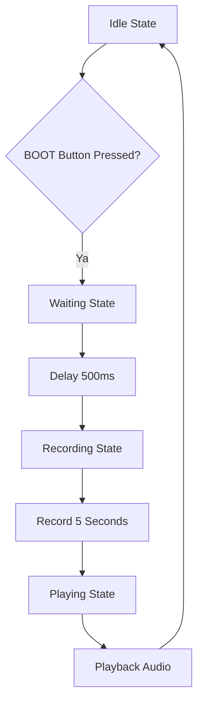

# ESP32-S3 Voice Recorder dengan PSRAM dan Display 1.8"

Proyek Voice Recorder berbasis ESP32-S3 yang dapat merekam suara selama 5 detik menggunakan PSRAM dan menampilkan status pada LCD ST7735 1.8" 128x160.

## 🎯 Fitur Utama

- **Recording Audio**: Merekam suara selama 5 detik dengan kualitas 16kHz
- **PSRAM Support**: Menggunakan PSRAM 8MB untuk buffer recording
- **Display ST7735**: LCD 1.8" 128x160 untuk menampilkan status
- **LED Indicator**: WS2812B RGB LED untuk status visual
- **Auto Playback**: Memutar ulang rekaman secara otomatis setelah selesai
- **Button Delay**: Delay 500ms untuk menghindari suara klik tombol

## 📋 Spesifikasi Teknis

| Parameter | Nilai |
|-----------|-------|
| Sample Rate | 16,000 Hz |
| Recording Time | 5 detik |
| Buffer Size | 512 samples |
| Total Samples | 80,000 samples (5s × 16kHz) |
| Memory Usage | 160KB (80,000 × 2 bytes) |
| Audio Format | 16-bit PCM |

## 🛠️ Komponen yang Dibutuhkan

### Hardware
- **ESP32-S3** Development Board
- **ST7735** LCD 1.8" 128x160
- **I2S Microphone** (INMP441 atau sejenis)
- **I2S Speaker/Amplifier**
- **WS2812B** RGB LED
- **Button** (BOOT button ESP32-S3)

### Software
- **Arduino IDE** 2.0+
- **ESP32 Board Package**
- Library:
  - Adafruit GFX Library
  - Adafruit ST7735
  - Adafruit NeoPixel

## 🔌 Pinout Konfigurasi

### LCD ST7735 (1.8" 128x160)
| Pin LCD | Pin ESP32-S3 | Fungsi |
|---------|--------------|---------|
| SCLK | GPIO 21 | SPI Clock |
| MOSI | GPIO 47 | SPI Data |
| CS | GPIO 41 | Chip Select |
| DC | GPIO 40 | Data/Command |
| RST | GPIO 45 | Reset |
| BL | GPIO 42 | Backlight |

### Audio I2S
| Komponen | Pin ESP32-S3 | Fungsi |
|----------|--------------|---------|
| Speaker DOUT | GPIO 7 | Data Out |
| Speaker BCLK | GPIO 15 | Bit Clock |
| Speaker LRC | GPIO 16 | Left/Right Clock |
| Microphone WS | GPIO 4 | Word Select |
| Microphone SCK | GPIO 5 | Serial Clock |
| Microphone SD | GPIO 6 | Serial Data |

### Lainnya
| Komponen | Pin ESP32-S3 | Fungsi |
|----------|--------------|---------|
| WS2812B LED | GPIO 48 | RGB LED Indicator |
| BOOT Button | GPIO 0 | Start Recording |

## 🎨 Status LED Indicator

| Status | Warna LED | Deskripsi |
|--------|-----------|-----------|
| **Idle/Ready** | OFF | Siap merekam |
| **Waiting** | KUNING | Menunggu delay 500ms |
| **Recording** | MERAH (berkedip) | Sedang merekam |
| **Playing** | HIJAU | Memutar rekaman |

## 📱 Display Interface

### Screen Layout
- **Title Bar**: "VOICE RECORDER" dengan border biru
- **Status Area**: Menampilkan status saat ini
- **Progress Bar**: Indikator progres recording/playback
- **Info Panel**: Informasi waktu rekaman dan status PSRAM

### Screen States
1. **Idle Screen**: 
   - Status "READY"
   - Instruksi "Press BOOT to record"
   - Info waktu rekaman dan PSRAM

2. **Waiting Screen**:
   - Status "GETREADY"
   - Countdown timer 0.5s
   - LED kuning

3. **Recording Screen**:
   - Status "RECORDING" merah
   - Timer countdown 5→0
   - Progress bar merah
   - LED merah berkedip

4. **Playing Screen**:
   - Status "PLAYING" hijau
   - Progress percentage
   - Progress bar hijau
   - LED hijau

## 🔧 Instalasi dan Konfigurasi

### 1. Persiapan Arduino IDE
1. Install Arduino IDE 2.0 atau versi terbaru
2. Tambahkan ESP32 Board Manager:
   - File → Preferences → Additional Boards Manager URLs
   - Tambahkan: `https://raw.githubusercontent.com/espressif/arduino-esp32/gh-pages/package_esp32_index.json`
3. Install ESP32-S3 board package

### 2. Konfigurasi Board
1. Pilih board: **ESP32S3 Dev Module**
2. Set PSRAM: **Tools → PSRAM → "OPI PSRAM"**
3. Partition Scheme: **"Default 4MB with spiffs..."**

### 3. Install Library
```bash
# Via Arduino Library Manager
- Adafruit GFX Library
- Adafruit ST7735 and ST7789 Library  
- Adafruit NeoPixel Library
```

### 4. Upload Kode
1. Sambungkan ESP32-S3 via USB
2. Pilih port yang sesuai
3. Upload sketch `07-ESP32S3-VoiceRecorder-withPSRAM-display1.8.ino`

## 🔄 Alur Kerja Sistem



## ⚙️ Konfigurasi Kustom

### Mengubah Waktu Recording
Ubah nilai `RECORD_TIME` pada baris 48:
```cpp
#define RECORD_TIME   5  // Ubah nilai ini (dalam detik)
```

### Mengubah Sample Rate
Ubah nilai `SAMPLE_RATE` pada baris 47:
```cpp
#define SAMPLE_RATE   16000  // 8kHz, 16kHz, 32kHz, dll
```

### Mengubah Button Delay
Ubah nilai `BUTTON_DELAY` pada baris 50:
```cpp
#define BUTTON_DELAY  500  // Delay dalam milidetik
```

## 🐛 Troubleshooting

### Masalah Umum dan Solusi

#### 1. PSRAM Tidak Terdeteksi
**Gejala**: Error "No memory!" di display
**Solusi**:
- Pastikan PSRAM diaktifkan: Tools → PSRAM → "OPI PSRAM"
- Gunakan ESP32-S3 dengan PSRAM
- Cek koneksi hardware

#### 2. Audio Tidak Berfungsi
**Gejala**: Tidak ada suara saat recording/playback
**Solusi**:
- Periksa koneksi I2S microphone dan speaker
- Pastikan pin configuration sesuai
- Cek kualitas kabel dan solderan

#### 3. Display Blank
**Gejala**: LCD tidak menampilkan apapun
**Solusi**:
- Periksa koneksi SPI LCD
- Pastikan backlight aktif (PIN_TFT_BL)
- Cek konfigurasi pin di kode

#### 4. Recording Terlalu Pendek
**Gejala**: Recording berhenti sebelum waktunya
**Solusi**:
- Pastikan PSRAM terdeteksi dengan benar
- Kurangi `RECORD_TIME` jika memory kurang
- Cek ketersediaan memory di Serial Monitor

## 📊 Memory Management

| Memory Type | Usage | Available |
|-------------|-------|-----------|
| **PSRAM** | 160KB (recording buffer) | ~8MB |
| **Internal RAM** | Program + buffers | ~512KB |
| **Flash** | Program code | 4MB+ |

## 🔍 Debugging

### Serial Monitor Output
Buka Serial Monitor dengan baud rate 115200 untuk melihat:
- Status initialization
- PSRAM detection
- Recording/playback progress
- Error messages

### LED Debug Patterns
- **Red-Blue-Green sequence**: Startup test
- **Solid Red**: Recording in progress  
- **Solid Green**: Playback in progress
- **Off**: Idle state

## 📝 Catatan Penting

1. **PSRAM Wajib**: Project ini membutuhkan ESP32-S3 dengan PSRAM
2. **Audio Quality**: Sample rate 16kHz memberikan kualitas voice yang baik
3. **Power Supply**: Gunakan power supply yang stabil untuk audio
4. **Grounding**: Pastikan ground yang baik antara semua komponen

## 🚀 Pengembangan Selanjutnya

Fitur yang dapat ditambahkan:
- [ ] Multiple recording slots
- [ ] SD card storage
- [ ] Voice activation
- [ ] Bluetooth audio streaming
- [ ] Web interface control

## 📄 Lisensi

Proyek ini dilisensikan di bawah MIT License.

## 👨‍💻 Kontributor

Dikembangkan untuk project ESP32-S3 Voice Recorder dengan display 1.8".

---

**Happy Coding!** 🎤🔊